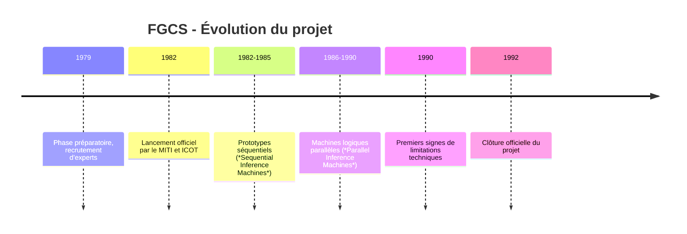

# 🇯🇵 Le Projet Japonais "Ordinateur de Cinquième Génération" (FGCS)

## 1. 🎯 Objectif
Lancé officiellement en **1982** par le **MITI** (*Ministry of International Trade and Industry*) via l’institut **ICOT** (*Institute for New Generation Computer Technology*), le FGCS visait à créer une **nouvelle génération d’ordinateurs** optimisés pour l’**IA symbolique**.

**Ambitions principales :**
- Passer d’une informatique "calculatrice" à une informatique **raisonnante**.
- Traiter la **connaissance** plutôt que de simples données.
- Permettre un **dialogue en langage naturel** avec la machine.
- Ouvrir la voie à la **traduction automatique** et à la **planification intelligente**.

---

## 2. 🛠️ Principes technologiques

1. **Architecture massivement parallèle**
   - Des centaines de processeurs travaillant simultanément.
   - Interconnexion rapide via un réseau *dataflow*.

2. **Langage pivot : Prolog**
   - Programmation logique comme socle.
   - Manipulation directe de faits et règles.

3. **Bases de connaissances étendues**
   - Contenant faits, règles et modèles du monde réel.
   - Exploitées via un moteur d’inférence déductif.

4. **Applications cibles**
   - Dialogue en langage naturel.
   - Systèmes experts avancés.
   - Traduction automatique.
   - Aide à la décision industrielle.

---

## 3. 📅 Chronologie

# 🇯🇵 FGCS : Rêve, Limites et Héritage

## 1. 📈 Pourquoi le projet FGCS faisait rêver

- **Budget massif et soutien étatique**
  - ~50 milliards de yens investis par le MITI.
  - Vision nationale claire : faire du Japon le leader mondial de l’IA.

- **Technologie de rupture**
  - Architecture **massivement parallèle** pour dépasser les limites des processeurs séquentiels.
  - Langage logique **Prolog** comme standard de programmation pour manipuler directement la connaissance.

- **Applications futuristes**
  - Dialogue homme-machine en langage naturel.
  - Traduction automatique de haute qualité.
  - Systèmes experts capables de planifier et diagnostiquer dans des domaines complexes.

- **Contexte international stimulant**
  - Rivalité avec les programmes américains (*DARPA Strategic Computing*) et européens (*ESPRIT*).
  - Narratif quasi “course à la Lune” de l’intelligence artificielle.

---

## 2. ⚠️ Limites et échec relatif

- **Rigidité technologique**
  - Choix exclusif de Prolog : expressif pour la logique, mais peu performant pour d’autres paradigmes.
  - Difficulté d’adapter les architectures logiques aux applications réelles complexes.

- **Problème du goulot d’étranglement**
  - Acquisition et formalisation des connaissances extrêmement coûteuses en temps et en expertise.
  - Les systèmes experts atteignaient vite une saturation fonctionnelle.

- **Évolution du contexte**
  - Processeurs généralistes (Intel, Motorola) ont progressé plus vite que prévu.
  - Émergence des approches statistiques et *machine learning* dans les années 90, déplaçant le centre de gravité de l’IA.

- **Résultats en deçà des attentes**
  - Les démonstrateurs fonctionnaient, mais sans révolutionner la pratique industrielle.
  - Difficulté à dépasser les prototypes pour atteindre des déploiements massifs.

---

## 3. 🧾 Héritage du FGCS

- **Progrès techniques**
  - Recherche avancée en **calcul parallèle** et en **architectures distribuées**.
  - Optimisation d’exécuteurs Prolog et moteurs d’inférence parallèles.

- **Formation et culture**
  - Une génération entière de **knowledge engineers** et chercheurs formés aux systèmes à base de connaissances.

- **Effet catalyseur**
  - Stimulation de programmes concurrents :
    - 🇺🇸 **DARPA Strategic Computing**
    - 🇪🇺 **Programme ESPRIT**
  - Influence sur les futures architectures spécialisées (GPU, TPU, puces neuromorphiques).

- **Leçon stratégique**
  - Importance de la flexibilité technologique.
  - Limites des approches monolithiques en IA.
  - Nécessité d’anticiper les changements de paradigme.

---

> 💬 **En bref** :  
> Le FGCS a incarné l’optimisme technologique des années 80 et a marqué une génération d’ingénieurs, mais son pari sur une seule architecture et un seul paradigme a limité son impact industriel direct.  
> Son véritable héritage réside dans la recherche en calcul parallèle, la formation d’experts et l’inspiration qu’il a suscitée.

