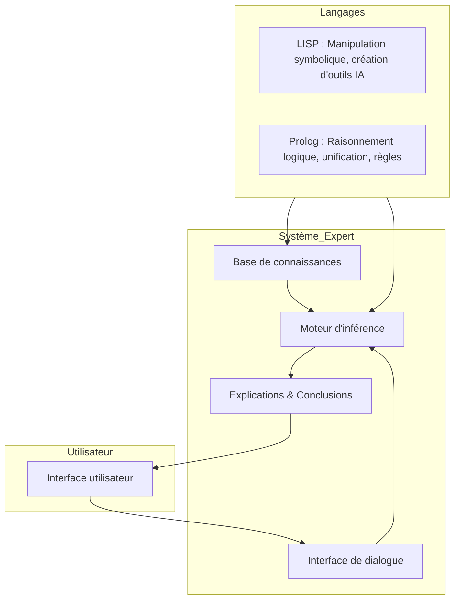
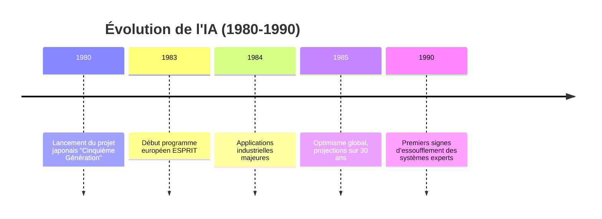

# Framentec_Expert_Systems

---
title: "Les Systèmes Experts (1983-1987)"
author: "Olivier Croissant"

# 💡 Contexte Historique

> **Milieu des années 80** : l’âge d’or de l’IA symbolique, avant la domination du *machine learning* moderne.

L’âge d’or des systèmes experts débute au tournant des années 1970-1980, dans le sillage des travaux pionniers de l’université de Stanford. Parmi les projets emblématiques, EMYCIN (Essential MYCIN) occupe une place centrale : dérivé du système médical MYCIN, il fournit un moteur d’inférence générique, indépendant du domaine, permettant de réutiliser la logique du diagnostic dans d’autres secteurs que l’infectiologie. Cette approche marque la naissance des environnements de développement de systèmes experts “vides” mais prêts à être dotés de connaissances spécifiques. Dans la même veine, KS-300, développé pour la configuration d’équipements électriques, illustre la capacité des systèmes experts à résoudre des problèmes industriels complexes en exploitant des bases de règles extensibles. Ces succès, conjugués à l’émergence de langages comme LISP et Prolog et à l’enthousiasme suscité par l’intelligence artificielle symbolique, alimentent dans les années 1980 un optimisme technologique sans précédent : celui d’ordinateurs capables non seulement de calculer, mais de raisonner.

**Technologies phares**  
- Langages : `LISP`, `PROLOG`
  
Créé en 1958 par John McCarthy au MIT, LISP (LISt Processing language) est l’un des plus anciens langages de programmation encore utilisés. Conçu initialement pour la recherche en intelligence artificielle, il se distingue par :

    Structure de données centrale : la liste, à la fois donnée et programme.

    Syntaxe minimale : tout est une expression (S-expression) composée de parenthèses imbriquées.

    Homoiconicité : le code et les données partagent la même structure, facilitant la manipulation et la génération de programmes par les programmes eux-mêmes.

    Évaluation dynamique et garbage collector intégrés, très en avance sur leur temps.

    Extensibilité : il est facile de définir de nouvelles fonctions, macros et mini-langages internes.

Dans les années 1970-1980, LISP devient le langage de référence pour les systèmes experts et les applications IA, au point d’inspirer des machines LISP dédiées. Aujourd’hui encore, ses descendants (Common Lisp, Scheme, Clojure) conservent cette philosophie de flexibilité et de manipulation symbolique puissante.

---
Créé au début des années 1970 par Alain Colmerauer et Philippe Roussel à Marseille, Prolog (PROgramming in LOGic) est un langage de programmation fondé sur la logique du premier ordre.
Il se distingue par son paradigme déclaratif : le programmeur décrit ce qui est vrai dans un domaine, et laisse le moteur d’inférence déterminer comment répondre aux questions.

Caractéristiques clés :

    Base de faits et de règles : le savoir est exprimé sous forme de clauses logiques (fait. ou but :- conditions.).

    Moteur d’inférence intégré : recherche arrière (backward chaining) et unification de variables.

    Non-déterminisme : exploration automatique de plusieurs solutions possibles.

    Manipulation naturelle de structures symboliques (listes, arbres).

    Applications typiques : systèmes experts, traitement du langage naturel, planification, raisonnement symbolique.

Dans les années 1980, Prolog devient un pilier des projets d’IA symbolique — en particulier le projet japonais d’ordinateur de cinquième génération, qui en fait son langage central pour manipuler la connaissance à grande échelle. Aujourd’hui encore, Prolog reste utilisé dans la recherche en IA, les solveurs logiques et certains moteurs de règles industriels.

| Aspect                | **LISP**                                          | **Prolog**                                       |
|-----------------------|---------------------------------------------------|--------------------------------------------------|
| **Date de création**  | 1958 – John McCarthy (MIT)                        | 1972 – Alain Colmerauer & Philippe Roussel (Marseille) |
| **Paradigme**         | Fonctionnel, symbolique                           | Déclaratif, logique du premier ordre             |
| **Unité de base**     | Liste (*S-expression*)                            | Clause logique (fait ou règle)                   |
| **Syntaxe**           | Uniforme et parenthésée, manipulation de listes   | Règles lisibles proches du langage naturel       |
| **Mécanisme central** | Évaluation d’expressions et application de fonctions | Unification et moteur d’inférence (*backward chaining*) |
| **Points forts**      | Manipulation flexible de structures complexes, macros puissantes | Représentation naturelle de connaissances, recherche automatique de solutions |
| **Applications typiques** | Systèmes experts, IA générale, manipulation symbolique, IA embarquée | Systèmes experts, traitement du langage naturel, planification |
| **Influence historique** | Langage emblématique des *Lisp machines* et de la recherche IA | Langage central du projet japonais FGCS et de nombreux moteurs de règles |

### 🧠 Base de connaissances et moteur d’inférence logique
## 1. Base de connaissances (BC)

La base de connaissances est le cœur informationnel d’un système expert.
Elle contient tout ce que le système sait sur un domaine donné, représenté de manière explicite et exploitable par un programme.

# Composants typiques :

    Faits : énoncés simples considérés comme vrais dans le domaine.
    Exemple : animal(chien). ou température(chaudière, 90).

    Règles : relations logiques conditionnelles qui relient des faits.
    Exemple : alerte(X) :- température(X, T), T > 80.

    Métadonnées : certitude, priorités, liens vers des sources.

# Représentations possibles :

    Listes et structures symboliques (LISP)

    Clauses logiques (Prolog)

    Tableaux, graphes ou réseaux sémantiques

## 2. Moteur d’inférence

Le moteur d’inférence est le composant “raisonneur” du système.
Il applique des règles logiques à la base de connaissances pour déduire de nouvelles informations ou prendre des décisions.

Fonctions principales :

    Unification

        Faire correspondre des modèles logiques avec les faits existants.

    Chaînage avant (forward chaining)

        Partir des faits connus pour en déduire de nouveaux, jusqu’à atteindre un objectif.

    Chaînage arrière (backward chaining)

        Partir d’un objectif ou d’une question, et remonter pour vérifier quelles conditions doivent être vraies.

    Gestion des conflits

        Choisir quelle règle appliquer lorsqu’il y en a plusieurs possibles.

## 3. Interaction BC ↔ Moteur d’inférence

On peut résumer leur rôle ainsi :

    BC = Mémoire (ce que le système sait)

    Moteur = Raisonneur (comment il pense)

Cycle typique :

    L’utilisateur pose une question ou fournit de nouvelles données.

    Le moteur recherche dans la BC les faits/règles pertinents.

    Des règles sont appliquées pour générer de nouvelles conclusions.

    Les conclusions sont ajoutées à la BC et/ou restituées à l’utilisateur.

📌 Dans les années 1980, cette séparation claire entre connaissance (domaine) et raisonnement (mécanisme générique) a permis de créer des moteurs réutilisables (EMYCIN, OPS5, Prolog) capables d’alimenter de nombreux systèmes experts dans des domaines variés — médical, industriel, militaire, etc.

- Moteurs d’inférence & bases de connaissances

**Course géostratégique**
- 🇯🇵 **Cinquième Génération** – IA symbolique massive
   **["Cinquieme_Generation"](./Cinquieme_Generation.md)
- 🇺🇸 **DARPA** – 150 M$/an, volet militaire  
- 🇪🇺 **ESPRIT** (1,5 Md ECU) & **ALVEY** (300 M$)
-  🚀**Presentation Framatome du 15 Juin 1985**
- **["presentation_Framatome_1985"](./Presentation_Framatome_1985.md))

---

# 🏭 Applications Industrielles

| Secteur       | Exemple d’application                     | Acteurs clés |
|---------------|--------------------------------------------|-------------|
| **Énergie**   | Surveillance de réacteurs nucléaires       | Hitachi, Framatome, CEA |
| **Pétrole**   | Drilling Advisor, Dipmeter Advisor         | Schlumberger, ELF |
| **Médical**   | MYCIN, INTERNIST                           | Stanford, MIT |
| **Aérospatial**| Planification de mission, maintenance     | NASA, RAND Corp. |
| **Informatique** | Configuration matérielle (R1), YES/MVS  | DEC, IBM |

---

# 🔧 Méthodologie de Développement

**Phases clés**  
1. 🕵 **Identification du problème** – 0,5 à 2 jours  
2. 📊 **Évaluation technico-économique** – 2 à 4 jours  
3. 🧪 **Prototypage** – 3 à 6 mois  
4. 🚀 **Déploiement complet** – jusqu’à plusieurs années

---

# 🧠 Compétences Requises

| Approche                  | IA  | Informatique | Métier |
|---------------------------|-----|--------------|--------|
| **From scratch**          | +++ | +++          | +++    |
| **Avec outils existants** |  +  |  +           | +++    |

---

# ✅ Avantages

- Gain de temps significatif  
- Performance des moteurs d’inférence  
- Convivialité et fiabilité accrues

# ⚠️ Limites

- Paradigmes rigides  
- Difficultés d’intégration  
- **Acquisition des connaissances** : goulot d’étranglement

---

# 📅 Timeline

## Les Outils de Framentec

# Outils de Génie de la Connaissance Framentec : M.1 et S.1

Cet aperçu compare deux outils de génie de la connaissance de Framentec, M.1 et S.1, en soulignant leurs points communs et leurs différences.

---

## Présentation de M.1

M.1 est un outil de génie de la connaissance puissant et facile à utiliser pour les ordinateurs personnels, conçu pour développer et exécuter des systèmes experts autonomes. Il est particulièrement adapté pour :

- Prototypage rapide de systèmes potentiellement opérationnels à grande échelle
- Systèmes opérationnels avec plus de 200 entrées de base de connaissances

### Caractéristiques clés
- **Accessibilité** : Maîtrisable sans connaissances préalables en génie de la connaissance (expérience en programmation suffisante)
- **Premier outil** avec fonctionnalités significatives pour micro-ordinateurs
- **Fonctionnement** : 
  - Base de connaissances : faits et règles en langage "anglais-like"
  - Dialogue questions-réponses pendant les consultations
  - Capacité à fournir des explications sur le raisonnement

### Domaines d'application
Particulièrement adapté aux **problèmes de sélection structurée** :
- Diagnostic de pannes machines
- Diagnostic médical
- Recommandation d'outils

 **["M1_UserGuide"](./M1_UserGuide.pdf)**  

---

## Présentation de S.1

S.1 est présenté comme l'outil de génie de la connaissance le plus puissant de son époque, conçu spécifiquement pour l'environnement industriel. C'est un ensemble intégré de :
- Logiciels
- Formation
- Support

### Architecture des connaissances
Base de connaissances structurée en trois types distincts :
1. **Connaissances factuelles** :  
   Assertions sur les objets et leurs relations (système de "frames")
2. **Connaissances de jugement** :  
   Règles heuristiques ("if-then")
3. **Connaissances procédurales** :  
   Séquences de résolution de problèmes ("blocs de contrôle")

### Fonctionnalités avancées
- Objectif de consultation : exécution de "blocs de contrôle" de niveau supérieur
- Outils de test : 
  - Sauvegarde/réexécution de cas tests
  - Traçage des actions système
- Création de systèmes "consultation uniquement" (protection des connaissances)
- Applications typiques : Identification de défaillances machines, diagnostic médical

   **["S1_UserGuide"](./S1_UserGuide.pdf)**  

---

## Points Communs

| Caractéristique               | M.1 et S.1                                     |
|-------------------------------|------------------------------------------------|
| **Objectif**                  | Création de systèmes experts                  |
| **Application**               | Problèmes de sélection structurée             |
| **Représentation**            | Règles "if-then" + facteurs de certitude      |
| **Interface utilisateur**     | Consultations questions-réponses + explications |
| **Outils développement**      | Traçage, édition KB, sauvegarde de cas tests  |

---

## Différences

### Architecture et Fonctionnalités

| Critère                     | M.1                                      | S.1                                      |
|-----------------------------|------------------------------------------|------------------------------------------|
| **Public cible**            | Micro-ordinateurs (prototypage rapide)   | Environnement industriel (grande échelle) |
| **Connaissances procédurales** | Absentes                                | "Blocs de contrôle" implémentés          |
| **Représentation**          | Langage unique "english-like"            | Système de frames (objet-attribut-valeur) |
| **Gestion objets**          | Attributs multi-valeurs                  | Hiérarchies de classes + instanciation dynamique |
| **Interfaçage**             | Import/Export basique de données         | Connexion Lisp/Fortran/C/Pascal          |

### Formation et Support

| Aspect                 | M.1                                  | S.1                                  |
|------------------------|--------------------------------------|--------------------------------------|
| **Formation**          | 4 jours (programmeurs sans expérience GE) | 2 semaines (personnel technique expérimenté) |
| **Environnement**      | IBM PC/compatibles (256K min)        | Stations Xerox 1100/1108, DEC VAX, Symbolics |
| **Interface dev**      | Fenêtres simples                     | Multi-fenêtres spécialisées (Lisp, Help, etc.) |

