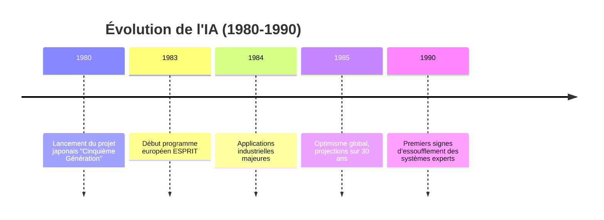

# Framentec_Expert_Systems
Expert systems  1983-1984
---
title: "Les Systèmes Experts (1984-1985)"
author: "Olivier Croissant"
date: "2025"
---

# 💡 Contexte Historique

> **Milieu des années 80** : l’âge d’or de l’IA symbolique, avant la domination du *machine learning* moderne.

**Technologies phares**  
- Langages : `LISP`, `PROLOG`  
- Moteurs d’inférence & bases de connaissances

**Course géostratégique**
- 🇯🇵 **Cinquième Génération** – IA symbolique massive  
- 🇺🇸 **DARPA** – 150 M$/an, volet militaire  
- 🇪🇺 **ESPRIT** (1,5 Md ECU) & **ALVEY** (300 M$)

---

# 🏭 Applications Industrielles

| Secteur       | Exemple d’application                     | Acteurs clés |
|---------------|--------------------------------------------|-------------|
| **Énergie**   | Surveillance de réacteurs nucléaires       | Hitachi, Framatome, CEA |
| **Pétrole**   | Drilling Advisor, Dipmeter Advisor         | Schlumberger, ELF |
| **Médical**   | MYCIN, INTERNIST                           | Stanford, MIT |
| **Aérospatial**| Planification de mission, maintenance     | NASA, RAND Corp. |
| **Informatique** | Configuration matérielle (R1), YES/MVS  | DEC, IBM |

---

# 🔧 Méthodologie de Développement

**Phases clés**  
1. 🕵 **Identification du problème** – 0,5 à 2 jours  
2. 📊 **Évaluation technico-économique** – 2 à 4 jours  
3. 🧪 **Prototypage** – 3 à 6 mois  
4. 🚀 **Déploiement complet** – jusqu’à plusieurs années

---

# 🧠 Compétences Requises

| Approche                  | IA  | Informatique | Métier |
|---------------------------|-----|--------------|--------|
| **From scratch**          | +++ | +++          | +++    |
| **Avec outils existants** |  +  |  +           | +++    |

---

# ✅ Avantages

- Gain de temps significatif  
- Performance des moteurs d’inférence  
- Convivialité et fiabilité accrues

# ⚠️ Limites

- Paradigmes rigides  
- Difficultés d’intégration  
- **Acquisition des connaissances** : goulot d’étranglement

---

# 📅 Timeline

## Les Outils de Framentec

# Outils de Génie de la Connaissance Framentec : M.1 et S.1

Cet aperçu compare deux outils de génie de la connaissance de Framentec, M.1 et S.1, en soulignant leurs points communs et leurs différences.

---

## Présentation de M.1

M.1 est un outil de génie de la connaissance puissant et facile à utiliser pour les ordinateurs personnels, conçu pour développer et exécuter des systèmes experts autonomes. Il est particulièrement adapté pour :

- Prototypage rapide de systèmes potentiellement opérationnels à grande échelle
- Systèmes opérationnels avec plus de 200 entrées de base de connaissances

### Caractéristiques clés
- **Accessibilité** : Maîtrisable sans connaissances préalables en génie de la connaissance (expérience en programmation suffisante)
- **Premier outil** avec fonctionnalités significatives pour micro-ordinateurs
- **Fonctionnement** : 
  - Base de connaissances : faits et règles en langage "anglais-like"
  - Dialogue questions-réponses pendant les consultations
  - Capacité à fournir des explications sur le raisonnement

### Domaines d'application
Particulièrement adapté aux **problèmes de sélection structurée** :
- Diagnostic de pannes machines
- Diagnostic médical
- Recommandation d'outils

 **["M1_UserGuide"](./M1_UserGuide.pdf)**  

---

## Présentation de S.1

S.1 est présenté comme l'outil de génie de la connaissance le plus puissant de son époque, conçu spécifiquement pour l'environnement industriel. C'est un ensemble intégré de :
- Logiciels
- Formation
- Support

### Architecture des connaissances
Base de connaissances structurée en trois types distincts :
1. **Connaissances factuelles** :  
   Assertions sur les objets et leurs relations (système de "frames")
2. **Connaissances de jugement** :  
   Règles heuristiques ("if-then")
3. **Connaissances procédurales** :  
   Séquences de résolution de problèmes ("blocs de contrôle")

### Fonctionnalités avancées
- Objectif de consultation : exécution de "blocs de contrôle" de niveau supérieur
- Outils de test : 
  - Sauvegarde/réexécution de cas tests
  - Traçage des actions système
- Création de systèmes "consultation uniquement" (protection des connaissances)
- Applications typiques : Identification de défaillances machines, diagnostic médical

   **["S1_UserGuide"](./S1_UserGuide.pdf)**  

---

## Points Communs

| Caractéristique               | M.1 et S.1                                     |
|-------------------------------|------------------------------------------------|
| **Objectif**                  | Création de systèmes experts                  |
| **Application**               | Problèmes de sélection structurée             |
| **Représentation**            | Règles "if-then" + facteurs de certitude      |
| **Interface utilisateur**     | Consultations questions-réponses + explications |
| **Outils développement**      | Traçage, édition KB, sauvegarde de cas tests  |

---

## Différences

### Architecture et Fonctionnalités

| Critère                     | M.1                                      | S.1                                      |
|-----------------------------|------------------------------------------|------------------------------------------|
| **Public cible**            | Micro-ordinateurs (prototypage rapide)   | Environnement industriel (grande échelle) |
| **Connaissances procédurales** | Absentes                                | "Blocs de contrôle" implémentés          |
| **Représentation**          | Langage unique "english-like"            | Système de frames (objet-attribut-valeur) |
| **Gestion objets**          | Attributs multi-valeurs                  | Hiérarchies de classes + instanciation dynamique |
| **Interfaçage**             | Import/Export basique de données         | Connexion Lisp/Fortran/C/Pascal          |

### Formation et Support

| Aspect                 | M.1                                  | S.1                                  |
|------------------------|--------------------------------------|--------------------------------------|
| **Formation**          | 4 jours (programmeurs sans expérience GE) | 2 semaines (personnel technique expérimenté) |
| **Environnement**      | IBM PC/compatibles (256K min)        | Stations Xerox 1100/1108, DEC VAX, Symbolics |
| **Interface dev**      | Fenêtres simples                     | Multi-fenêtres spécialisées (Lisp, Help, etc.) |

